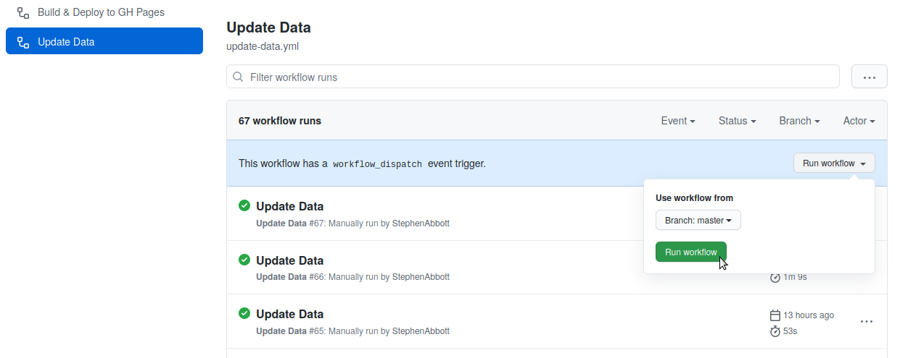

# opendataday


Open Data Day is a gathering of citizens in cities around the world to write applications, liberate data, create visualizations and publish analyses using open public data to show support for and encourage the adoption of open data policies by the world's local, regional and national governments.

You're invited. Again. The next Open Data Day will take place on Saturday 5 March 2022.

Check <http://opendataday.org> for public website.

## Editing / contributing

* This site is built with [Lektor](https://www.getlektor.com/).
* Install dependencies: `make install`
* Start dev server: `make serve`
* `grunt` will watch for changes to your [SCSS files](https://github.com/okfn/opendataday/tree/master/assets/scss), and also [icons](https://github.com/okfn/opendataday/tree/master/assets/icons) (see [svgstore](https://github.com/FWeinb/grunt-svgstore)).
* `lektor deploy` will deploy to the gh-pages branch, putting changes live, if you have deploy permissions.

## Translations

To translate the site we need to duplicate the [contents.lr](https://github.com/okfn/opendataday/blob/master/content/contents.lr) file, and save with the language code in the file name, like [contents+de.lr](https://github.com/okfn/opendataday/blob/master/content/contents%2Bde.lr).

We also need to add translations to:

* [global-content.ini](https://github.com/okfn/opendataday/blob/master/databags/global-content.ini)
* [events-content.ini](https://github.com/okfn/opendataday/blob/master/databags/events-content.ini)
* [reports-content.ini](https://github.com/okfn/opendataday/blob/master/databags/reports-content.ini)
* [main-nav.json](https://github.com/okfn/opendataday/blob/master/databags/main-nav.json)

If we are adding new language to the site we also need to:

* Add the new language to [languages.json](https://github.com/okfn/opendataday/blob/master/databags/languages.json)
* Add the language to [project.lektorproject](https://github.com/okfn/opendataday/blob/master/project.lektorproject)

## Running the site locally

Requirements:
- Python >= 3.6
- Node JS >= 10
- NPM >= 7

Setup:
- Create a python >=3.6 virtual environment
- Base requirements are defined in the `requirements.in` file (to ejecute `pip-compile` it's required to update `requirements.txt`)
- `pip install -r requirements.txt`
- `npm ci`
- `lektor server`
- http://127.0.0.1:5000/

## Updating the Site

Events are populated using a very lightweight import script which:

- Imports data from a google sheet
- Does some cleaning and checks on it
- Writes it out to a JSON file
- Generates .lr files for any event report
- Harvests any images we want to use on the site
- Commits the JSON file, event reports and images back to the repo (remember to `git pull`)
- Builds and deploys the site

This is run in a github action with a workflow_dispatch trigger, which allows our content manager to maintain the events in a spreadsheet update the site via a button in github.



In general, the import process is designed to be lax about missing fields and unexpected values. Some minimal validation is performed on the fields we require for the site to build correctly. Any errors will fail the action and be displayed in the GitHub actions log. e.g:

```
marshmallow.exceptions.ValidationError: {'Latitude': ['Not a valid number.'], 'Longitude': ['Not a valid number.']}
```

These will need to be resolved by editing the input spreadsheet.


There are three bits of setup we need to do each year:


- **1. Create a new import job:**
    - Create `./etl/202x.py` based on a previous year's file
    - Fill in `SPREADSHEET_ID`, `SHEET_ID` and `THIS_YEAR`
    - Update schema as applicable if the spreadsheet has changed, but we want to keep the JSON output the same if possible as every year's events page uses the same template to render the JSON to HTML
    - Replace the [GitHub workflow update-data.yml](/.github/workflows/update-data.yml) with the new job tu run `python ./etl/202X.py`. We don't need to keep running last year's script.
    - Once we've run the job for the first time it will create a `/databags/202x.json` file. This is consumed by the events list page and the events map
    - We can run `python ./etl/202x.py` locally as well as triggering it with GitHub actions
- **2. Update the map:**
    - Update [map.js file](/assets/js/map.js) to consume the new JSON file
- **3. Create a new events page:**
    - Create  `./content/events/202x/contents.lr` based on a previous year's file
    - Fill in the fields
    - Create a stub `./content/events/202x/contents.<lang>.lr` for each supported alternate language
    - It is not necessary to manually create the `./content/events/202x/reports` dir or edit any content under it. This will be automatically generated by the import job.
    - Add the new 202x events page to the menu:
        - Add `/events/202x` to the list of events pages ([main-nav.json](/databags/main-nav.json)).
        - Update the 'Search events' link to the current year ([main-nav.json](/databags/main-nav.json)).
        - Repeat for each supported alternate language

For reference, you can check the [PR for the 2022 update](https://github.com/okfn/opendataday/pull/345)

## Previous version

The previous version of the site has been moved to the [v1](https://github.com/okfn/opendataday/tree/v1) branch.
